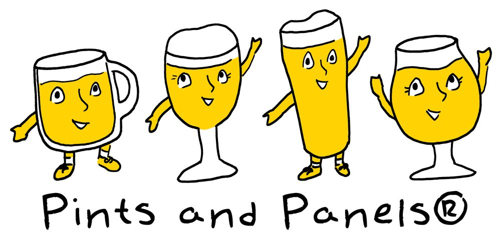

# Pints and Panels 啤酒漫画中文翻译项目

[Pints and Panels](https://www.pintsandpanels.com/) 啤酒漫画中文翻译项目

Em Sauter 是 Pints and Panels 系列漫画的原作者，屡获殊荣的漫画家，国际啤酒裁判，高级 Cicerone。2010年 Em Sauter 创办了 Pints and Panels，创作并发布了大量关于啤酒知识的漫画作品，同时Em Sauter还开设了线下啤酒系列课程和讲座，非常希望有一天她的讲座可以开到中国来。

经过与Em Sauter的沟通，很荣幸得到了她本人的许可，允许我们将其关于啤酒知识的漫画作品翻译成中文并在中文互联网进行分享。

之后我们会将《Pints and Panels 啤酒漫画》作为一个系列，持续在我们的微信公众号上翻译、分享、介绍，希望中文互联网世界的酒友们喜欢，同时也欢迎大家勘误、指正、转发、分享，但请在分享时务必保留 @PintsandPanels 的版权声明，这是对创作者最基本的尊重。

## 关注 Pints and Panels 的途径：
* 网站：[Pints and Panels](https://www.pintsandpanels.com/)
* Instagram：@PintsandPanels
* Twitter：@PintsandPanels

## 如果喜欢我们的中文译版，请关注我们：
* 微信公众号：letusbeerbrewpub
* 微博：乐啤酒社
* Instagram：@letusbeer
* Twitter：@letusbeer
* 小红书：948527466
* 抖音：letusbeer

## 协作规则
1. 从[P&P网站](https://www.pintsandpanels.com/educational-comics-archive)下载图片，按分类保存到对应文件夹，保持原文件名
2. 创建一个同名.md文件，存放中文翻译内容

## 命名规范
- abcd.jpeg  (原漫画图片)
- abcd.md   （中文翻译）
- abcd_cn.png（制作完成的中文片漫画图片）